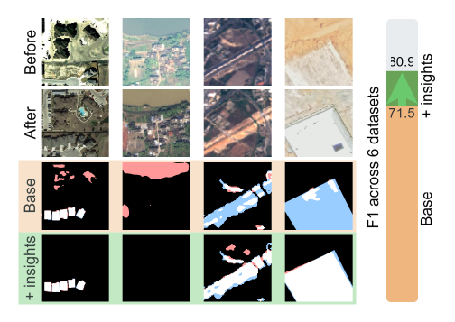
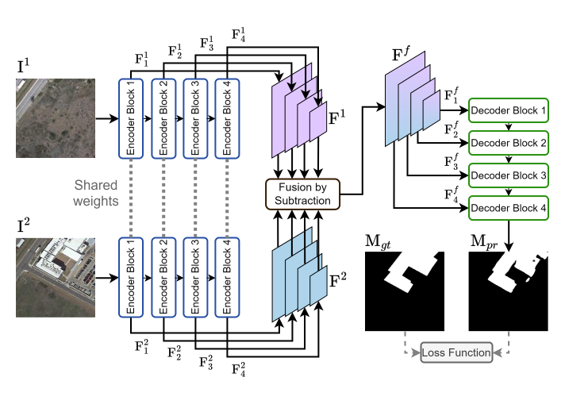

# Be the Change You Want to See: Revisiting Remote Sensing Change Detection Practices

This repository contains the codebase for **BTC (Be The Change)** and the accompanying analysis from our paper.

The work systematically investigates the impact of fundamental design choices in deep learning-based change 
detection, like pretraining strategies, data augmentations, loss functions, and learning rate schedulers. 
Building on these insights, we introduce BTC, a simple yet strong baseline that leverages these core components
to achieve state-of-the-art performance across multiple benchmark datasets.



### BTC architecture



## Environment setup

Create a Python environment and install required packages:

```bash
conda create -n btc_env python=3.10
conda activate btc_env

pip install -r requirements.txt
```

## Training and evaluation

Run the training and evaluation with:
```bash
python train.py --config configs/exp/BTC-B.yaml
```

Run evaluation only:
```bash
python train.py --config configs/exp/BTC-B.yaml --eval_only --ckpt_path <path to the weights (e.g. weights/clcd.pt)>
```

### Checkpoints:

The checkpoints are available [here](https://drive.google.com/drive/folders/1OND326JAw420C9F2yTaqyGDlTN8OLDON?usp=sharing)

### Data

By default, datasets are automatically downloaded from [huggingface](https://huggingface.co/ericyu)
and saved into `./datasets` directory. We thank Weikang Yu for making these splits publicly available.

> **Note:** The OSCD dataset on HuggingFace is not cropped into the original 96x96 tiles. We provide a corrected version (zip and HDF5 files) [here](https://drive.google.com/drive/folders/1VH_aR8tLtvVXKYwIhFxpBko9d46_Gn5P?usp=sharing). !

### Dataset Configuration Options

- data.use_hf=True (default): Use HuggingFace datasets.

- data.use_hf=False: For custom datasets in directory-based format.

When you have use_hf set to False, you can additionally set the following flags:

- data.load_in_mem=None (default): Read images from the disk on-the-fly.

- data.load_in_mem="direct": For custom datasets in directory-based format that is read into RAM first.

- data.load_in_mem="hdf5": For HDF5-formatted datasets (including our version of OSCD) that is read into RAM first.

#### Custom directory format

Use the following structure for custom directory dataset.
```
data_root/
    dataset_name/
       train/
            A/
                0.png
                ...
            B/
                0.png
                ...
            label/
                0.png
                ...
       test/
            A/
            B/
            label/
       val/
            A/
            B/
            label/
```

#### Custom HDF5 data

Set `data.load_in_mem` to "hdf5" and `data.use_hf=False` if you have the dataset in format with hdf5 files:
```
data_root/
    dataset_name/
        train.h5
        test.h5
        val.h5
```
Each HDF5 file must contain the following collections:
- imageA
- imageB
- label
- img_idx

## Results

All evaluation metrics (F1, Precision, Recall, cIoU) across seeds and methods are stored in the results directory. This includes:

- Design choice analysis
- BTC-T / BTC-B models
- Remote sensing foundation models
- Change detection-specific baselines

## Configuration files

All experiment configurations are available in the [configs directory](configs/exp). 

The directory also includes configurations for related remote sensing foundation models [here](configs/exp/sota/other) 
> For foundation models, please manually download weights and place them in weights/, or update paths in the config files.

### Custom configuration

The config file contains the configuration for the whole setup, including data, architecture and training parameters.
Refer to [BTC-B config file](configs/exp/BTC-B.yaml) for more details on each parameter.

You can manually override any argument in the command line without changing the config file. 
For example, to keep all the parameters from config but change the dataset name, simple do the following.

```bash
python train.py --config configs/BTC-B.yaml --data.dataset oscd96
```

The architecture follows the pipeline:
```text
encoder -> diff -> decoder
```

Additional modules like in_proc, pre_diff, and out_proc are supported but unused in this work (see `models/finetune_framework.py`).

Alternatively you can also list all arguments with:

```bash
python train.py -h
```

## Performance benchmarking

The benchmarking code and results are inside the [perf](./perf) directory.

Run model inference speed and efficiency evaluation with:
```bash
python perf.py
```

## Slurm

Slurm job scripts are included for both training and evaluation workflows.

## Reference

TBA - Paper currently under review.

## Questions

For issues or questions, please open a GitHub [issue](https://github.com/blaz-r/BTC-change-detection/issues) or email the author directly.